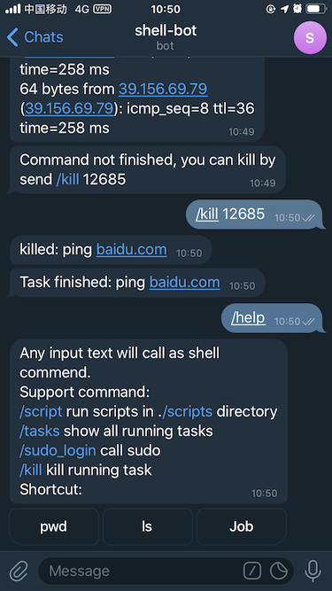

# Telegram Shell Bot

This is a [Telegram](http://telegram.org) Bot to run shell commands.



## Requirments

- Python 3.8+
- Poetry

curl -sSL https://install.python-poetry.org | python3 -
- pm2
 yarn global add pm2

## Install
1. Create a bot and get token from [BotFather bot](https://telegram.me/BotFather)
1. Clone `Telegram Shell Bot`

        git clone https://github.com/vicalloy/telegram-shell-bot.git

1. Copy `settings.py.sample` to `settings.py` and config it.
    - `TOKEN` Bot token generated by BotFather
    - `ENABLED_USERS` Your telegram user id. Only enabled users can use this bot.
        - `-999999` will disable authentication. Public bot is very danger for your server, dont's use root to run this bot. You must add settings `CMD_WHITE_LIST` or `ONLY_SHORTCUT_CMD=True`(recommend) for a public bot. 
    - `CMD_WHITE_LIST` Only command in `CMD_WHITE_LIST` can be execute. Let it empty if no restriction.
    - `CMD_BLACK_LIST` Ignore command in `CMD_BLACK_LIST`.
    - `CMD_BLACK_CHARS` Ignore command contain char in `CMD_BLACK_LIST`.
    - `PROXY_URL` Proxy url.
    - `SC_MENU_ITEM_ROWS` Command shortcut config.
    - `ONLY_SHORTCUT_CMD` Run command by shortcut menu only. Other commands will be ignored.

1. Create a virtual environment and install required packages

        poetry install --only main
        poetry shell

## Run

```
poetry run python bot.py
```


## Run with pm2

pm2 is one of the best tools today for server production and make your bot for remote online 24/7 hours

install and doc for pm2 in https://pm2.keymetrics.io/

start bot with
``` bash
pm2 start telegram-shell-bot.yml
pm2 save # save runing command
pm2 startup # for autostart on bot
```

## Usage

1. Talk to the bot. Every message will be treated as a shell command.
1. `/tasks` to show all running tasks
1. `/kill` to kill a running task
1. `/download` to download file from server. `ex: /download README.md`
1. The file send to bot will upload to folder `./upload/` .
1. `/sudo_login` to call sudo
1. `/script` to run scripts in ./scripts directory
1. The bot sends first 3sec's output for every command. You can add `oa` in command to send all output. E.g.:

        oa;ping google.com
        /script oa;demo.py
